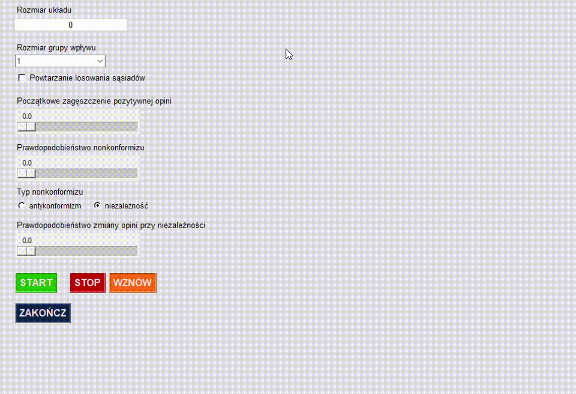

# Model-q-wyborcy
## Graficzny interfejs służący do symulowania modelu opinii społecznej.
Model zakłada istnienie agentów, każdy z nich ma pewną opinię, może być to opinia "na tak" (wartość 1)
albo "na nie" (wartość -1).<br>
W każdym kroku symulacji losowo wybrany agent zmienia swoją opinię.<br>
Zmiana ta zależy od opinii sąsiadów otaczających agenta (grupy wpływu).<br>
W przypadku konformizu agent przyjmuje opinię swoich sąsiadów (jeżeli są zgodni - mają taką samą opinię).<br>
W przypadku nonkonformizu możliwe są dwie opcje:
- antykonformizm - agent zmienia opinię na przeciwną, niż jego zgodni sąsiedzi,
- niezależność - agent zmienia opinię na taką samą jak jego sąsiedzi, ale z pewnym prawdopodobieństwem.

## O aplikacji
Aplikacja napisana jest w języku Python i służy do symulowania Modelu q-wyborcy.
Grupa wpływy każdego z agentów to czterej sąsiedzi.<br>
Użytkownik wprowadza parametry, a po naciśnięciu przycisku "START" uruchamia się animacja.<br>
Na sieci kwadratowej przedstawiona jest opinia każdego z agentów zmieniająca się w czasie (czas mierzony jest w krokach Monte Carlo).<br>
Kolorem zielonym oznaczeni są agenci z pozytywną opinią (wartość 1 - "na tak").<br>
Kolorem czerwonym oznaczeni są agenci z opinią negatywną (wartość -1 - "na nie").<br>
Natomiast animacja na wykresie przedstawia średnią opinię wszystkich agentów zmieniającą się w czasie.<br>
Przycisk "STOP" zatrzymuje animację.<br>
Przycisk "WZNÓW" wznawia animację, kiedy jest ona zatrzymana.<br>
Przycisk "ZAKOŃCZ" zamyka aplikację.<br>

## Instalowanie
Do uruchomienia aplikacji potrzebne są następujące moduły:
- tkinter,
- matplotlib,
- numpy,

aby je zainstalować w wierszu poleceń należy wpisać następujące polecenia:

``` shell
pip install tkinter
```
``` shell
pip install matplotlib
```
``` shell
pip install numpy
```
Należy również zainstalować moduł potrzebny do stworzenia pliku wykonalnego aplikacji:

``` shell
pip install pyinstaller
```
Z projektu należy pobrać pliki <b><em>assets.py</em></b> oraz <b><em>model_q-wyborcy_v2.py</em></b>.<br>
Należy pamiętać o tym, aby następne kroki wykonać z poziomu folderu, w którym znajdują się pobrane pliki.<br>
W celu zbudowania wykonalnego pliku należy wpisać w wierszu poleceń:

``` shell
pyinstaller model_q-wyborcy_v2.py
```
oraz 

``` shell
pyinstaller --onefile --windowed model_q-wyborcy_v2.py
```
Po wpisaniu tych poleceń wygeneruje się plik z rozszerzeniem <b><em>.exe</em></b>, w którym znajduje się zbudowana aplikacja.

## Przykłady użycia aplikacji
Przykład 1:
- mały rozmiar siatki (10x10),
- początkowe zagęszczenie pozytywnej opinii równe 0.5 (połowa osób "na tak", połowa "na nie"),
- prawdopodobieństwo nonkonformizumu równe 0 (konformizm).


Przykład 2:
- rozmiar siatki 50x50,
- początkowe zagęszczenie pozytywnej opinii równe 0.6 (więcej osób "na tak", niż "na nie"),
- prawdopodobieństwo nonkonformizumu równe 0.5 (typ antykonformizm).



Przykład 3:
- duży rozmiar siatki (100x100),
- początkowe zagęszczenie pozytywnej opinii równe 0.2 (o wiele mniej osób "na tak", niż "na nie"),
- prawdopodobieństwo nonkonformizumu równe 0.5 (typ niezależność),
- prawdopodobieństwo zmiany opinii przy niezależności równe 0.5.


